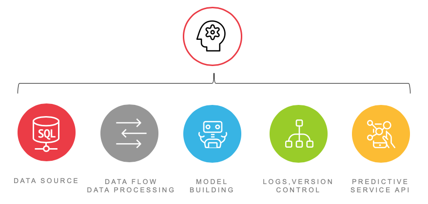
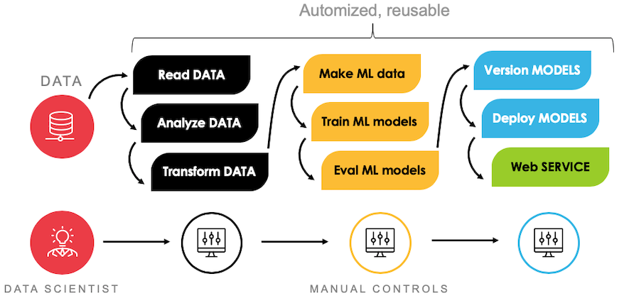
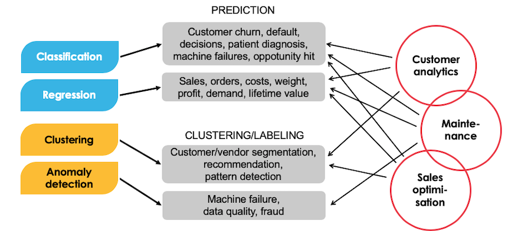

## Welcome to Bilot AI-core

### What is AI-core?

We wanted to do our own AI-projects faster and with fewer errors. Also, coding same things over and over again is quite stupid and boring. We also felt that the maintenance and development of multiple AI/ML-environments needs a coherent solution. We also wanted to create a solution which bends into several different business problems (e.g. IoT, Customer analytics). These factors led us to develop a "platform" that we call <b>AI-core</b>.

The Bilot <b>AI-core</b> is basically a collection of code, which facilitates robust development of Machine Learning solutions. It integrates data handling, preprocessing, error handling and logging, model training and versioning, model application, and deployment. All of this is handled with just a few lines of code.

The benefits of Bilot <b>AI-core</b> are the following. It speeds up AI/ML development, as all the code is mostly provided. This directly minimizes coding erros (reusable modules) and useless iterations. It is a solid framework for a multiple different ML-problems (business point-of-view). Coming in the form of open-source code, it offers limitless flexibility to the user-–modify as much as you like. As a consequence, while we might hold the best understanding of the framework, there is basically no vendor lock.

Last, but not least, the <b>AI-core</b> can be set up to any environment; this is fully up to the users/customers preferences. The set-up is very simple, whether the target is an on-premise machine, virtual machine, or cloud platform.   

----

### Features

<b>AI-core</b> provides capabilities for end-to-end development of machine leartning projects. The functionality is built into <i>modules</i> (collections of functions) that are used to: 

<ul>
  <li>take care of data connections (e.g., from local files or remote SQL server)</li>
  <li>retrieve data from source and make prepocessing</li>
  <li>train user-specified models</li>
  <li>write execution logs</li>
  <li>version traind models</li>
  <li>deployment, e.g., via predictive API service</li>
</ul>

  <i>End-to-end development of Machine Learning projects.</i>

----

### Workflow

In more detail, the workflow of ML project is about running routines that automatically perform the necessary steps of data processing, modelling and model optimisation, output handling, versioning, and deployment. 
The user has also manual control over the different parts of the workflow, by configuring settings files. 

  <i>Typical AI-core workflow.</i>

----

### Use-cases

<b>AI-core</b> can be used (at present) for problems considering structured data. Most of the functionality is built for <i>supervised learning</i> problems (classification & regression), but also clustering, anomaly detection and time-series forecasting are possible. These methods lend themselves to various business problems in different industries. 

  <i>Some examples of use-cases that can be solved with AI-core.</i>

----

### Interested?

Contact Bilot Sales: sales@bilot.fi
